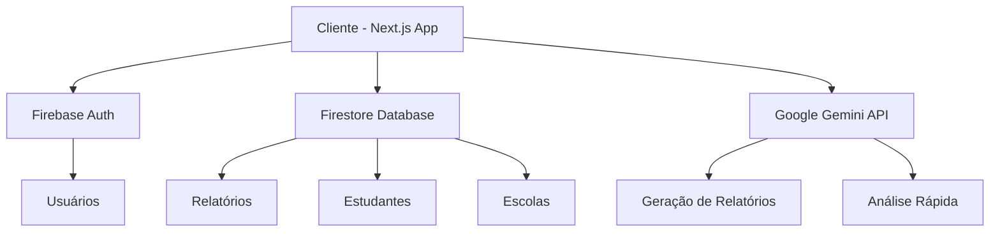

# Sistema de Relatórios Escolares com IA

## 🎯 Visão Geral

### Descrição do Projeto
Sistema web para geração automatizada de relatórios comportamentais de estudantes usando Inteligência Artificial (Google Gemini). O sistema permite que professores e coordenadores insiram dados sobre incidentes comportamentais e recebam relatórios profissionais estruturados.

### Objetivos
- **Automatizar** a criação de relatórios comportamentais
- **Padronizar** a linguagem e estrutura dos relatórios
- **Agilizar** o processo de documentação escolar
- **Melhorar** a qualidade das análises comportamentais
- **Centralizar** informações de estudantes e incidentes

### Tecnologias Utilizadas
- **Frontend**: Next.js 15 (App Router), React 19, TypeScript
- **Backend**: Firebase (Firestore, Authentication)
- **IA**: Google Gemini 1.5 Flash
- **Estilização**: Tailwind CSS
- **Gerenciador de Pacotes**: PNPM
- **Deploy**: Vercel (recomendado)

---

## 🏗️ Arquitetura do Sistema

### Diagrama de Arquitetura



### Fluxo de Dados

1. **Autenticação**: Usuário faz login via Firebase Auth
2. **Coleta de Dados**: Interface coleta dados do estudante e incidente
3. **Processamento IA**: Dados são enviados para o Gemini API
4. **Geração**: IA retorna relatório estruturado
5. **Armazenamento**: Relatório é salvo no Firestore
6. **Visualização**: Usuário visualiza e pode editar o relatório

---

## ⚙️ Configuração do Ambiente

### Pré-requisitos
- Node.js 18+ instalado
- PNPM instalado globalmente
- Conta no Google Cloud/Firebase
- Conta no Google AI Studio (para Gemini API)

### Instalação Inicial

```bash
# 1. Clone ou crie o projeto
npx create-next-app@latest escola-reports --typescript --tailwind --app

# 2. Entre no diretório
cd escola-reports

# 3. Instale as dependências
pnpm install firebase @types/node

# 4. Configure o PNPM (se necessário)
echo "shamefully-hoist=true" >> .npmrc
```

### Variáveis de Ambiente

Crie o arquivo `.env.local` na raiz do projeto:

```env
# Firebase Configuration
NEXT_PUBLIC_FIREBASE_API_KEY=AIzaSyxxxxxxxxxxxxxxxxxxxxxxx
NEXT_PUBLIC_FIREBASE_AUTH_DOMAIN=seu-projeto.firebaseapp.com
NEXT_PUBLIC_FIREBASE_PROJECT_ID=seu-projeto-id
NEXT_PUBLIC_FIREBASE_STORAGE_BUCKET=seu-projeto.appspot.com
NEXT_PUBLIC_FIREBASE_MESSAGING_SENDER_ID=123456789
NEXT_PUBLIC_FIREBASE_APP_ID=1:123456789:web:abcdef123456

# Google Gemini AI
NEXT_PUBLIC_GEMINI_API_KEY=AIzaSyxxxxxxxxxxxxxxxxxxxxxxx

# Configurações de Desenvolvimento
NODE_ENV=development
NEXT_PUBLIC_APP_URL=http://localhost:3000

# Configurações Opcionais
NEXT_PUBLIC_ENABLE_ANALYTICS=false
NEXT_PUBLIC_LOG_LEVEL=debug
```

### Arquivo .env.example

```env
# Firebase Configuration
NEXT_PUBLIC_FIREBASE_API_KEY=your_firebase_api_key
NEXT_PUBLIC_FIREBASE_AUTH_DOMAIN=your-project.firebaseapp.com
NEXT_PUBLIC_FIREBASE_PROJECT_ID=your-project-id
NEXT_PUBLIC_FIREBASE_STORAGE_BUCKET=your-project.appspot.com
NEXT_PUBLIC_FIREBASE_MESSAGING_SENDER_ID=your_messaging_sender_id
NEXT_PUBLIC_FIREBASE_APP_ID=your_app_id

# Google Gemini AI
NEXT_PUBLIC_GEMINI_API_KEY=your_gemini_api_key

# Environment
NODE_ENV=development
NEXT_PUBLIC_APP_URL=http://localhost:3000
```

---

## 📁 Estrutura do Projeto

### Estrutura Completa de Diretórios

```
escola-reports/
├── .env.local                    # Variáveis de ambiente (não committar)
├── .env.example                  # Template das variáveis
├── .gitignore                    # Arquivos ignorados
├── next.config.ts                # Configurações Next.js
├── package.json                  # Dependências
├── pnpm-lock.yaml               # Lock file do PNPM
├── postcss.config.mjs           # Configuração PostCSS
├── tailwind.config.js           # Configuração Tailwind
├── tsconfig.json                # Configuração TypeScript
├── README.md                    # Documentação básica
│
├── public/                      # Arquivos estáticos
│   ├── favicon.ico
│   ├── logo.png
│   └── manifest.json
│
├── app/                         # Next.js App Router (APENAS rotas)
│   ├── globals.css             # Estilos globais
│   ├── layout.tsx              # Layout raiz
│   ├── page.tsx                # Página inicial
│   ├── loading.tsx             # Loading global
│   ├── error.tsx               # Error boundary global
│   ├── not-found.tsx           # Página 404
│   │
│   ├── (auth)/                 # Grupo de rotas de autenticação
│   │   ├── layout.tsx         # Layout para páginas de auth
│   │   ├── login/
│   │   │   └── page.tsx       # Página de login
│   │   └── register/
│   │       └── page.tsx       # Página de registro
│   │
│   ├── dashboard/              # Área logada
│   │   ├── layout.tsx         # Layout do dashboard
│   │   ├── page.tsx           # Dashboard principal
│   │   ├── reports/
│   │   │   ├── page.tsx       # Lista de relatórios
│   │   │   ├── new/
│   │   │   │   └── page.tsx   # Novo relatório
│   │   │   └── [id]/
│   │   │       └── page.tsx   # Detalhes do relatório
│   │   ├── students/
│   │   │   ├── page.tsx       # Lista de estudantes
│   │   │   └── [id]/
│   │   │       └── page.tsx   # Perfil do estudante
│   │   └── settings/
│   │       └── page.tsx       # Configurações
│   │
│   └── api/                    # API Routes
│       ├── auth/
│       │   └── route.ts
│       ├── reports/
│       │   └── route.ts
│       └── ai/
│           ├── generate/
│           │   └── route.ts
│           └── analyze/
│               └── route.ts
│
├── components/                  # Componentes reutilizáveis
│   ├── ui/                     # Componentes básicos
│   │   ├── button.tsx
│   │   ├── input.tsx
│   │   ├── modal.tsx
│   │   └── index.ts           # Barrel export
│   ├── layout/                # Componentes de layout
│   │   ├── header.tsx
│   │   ├── sidebar.tsx
│   │   └── navigation.tsx
│   ├── forms/                 # Formulários
│   │   ├── login-form.tsx
│   │   └── student-form.tsx
│   └── reports/               # Componentes de relatórios
│       ├── report-generator.tsx
│       └── report-card.tsx
│
├── lib/                        # Configurações e utilitários
│   ├── firebase.ts            # Configuração Firebase
│   ├── gemini.ts              # Configuração Gemini
│   ├── utils.ts               # Funções utilitárias
│   └── constants.ts           # Constantes
│
├── hooks/                      # Custom hooks
│   ├── use-auth.ts
│   ├── use-gemini.ts
│   └── use-reports.ts
│
├── types/                      # Definições TypeScript
│   ├── index.ts               # Barrel export
│   ├── auth.ts
│   ├── report.ts
│   ├── student.ts
│   └── api.ts
│
├── contexts/                   # React Contexts
│   ├── auth-context.tsx
│   └── notification-context.tsx
│
├── services/                   # Camada de serviços
│   ├── auth.service.ts
│   ├── reports.service.ts
│   └── students.service.ts
│
└── utils/                      # Funções auxiliares
    ├── formatters.ts
    └── validators.ts
```

## 🔥 Configuração do Firebase

### 1. Criar Projeto Firebase

1. Acesse [console.firebase.google.com](https://console.firebase.google.com)
2. Clique em "Criar um projeto"
3. Nomeie o projeto (ex: "escola-reports")
4. Desabilite Google Analytics (não necessário para MVP)
5. Clique em "Criar projeto"

### 2. Configurar Authentication

1. No painel Firebase: **Authentication → Get started**
2. Aba **Sign-in method**:
   - Habilite **Email/password**
   - Habilite **Google** (configurar OAuth)
3. Em **Settings → Authorized domains**: adicionar domínio de produção

### 3. Configurar Firestore Database

1. No painel: **Firestore Database → Create database**
2. Escolha **Start in test mode** (ajustar regras depois)
3. Selecione localização: `southamerica-east1` (São Paulo)

### 4. Obter Configurações

1. **Configurações do projeto → Geral**
2. Seção **Seus apps** → Adicionar app Web
3. Registrar app: "escola-reports-web"
4. Copiar configurações para `.env.local`

### 5. Configuração no Código

```typescript
// lib/firebase.ts
import { initializeApp } from 'firebase/app';
import { getAuth, GoogleAuthProvider } from 'firebase/auth';
import { getFirestore } from 'firebase/firestore';

const firebaseConfig = {
  apiKey: process.env.NEXT_PUBLIC_FIREBASE_API_KEY!,
  authDomain: process.env.NEXT_PUBLIC_FIREBASE_AUTH_DOMAIN!,
  projectId: process.env.NEXT_PUBLIC_FIREBASE_PROJECT_ID!,
  storageBucket: process.env.NEXT_PUBLIC_FIREBASE_STORAGE_BUCKET!,
  messagingSenderId: process.env.NEXT_PUBLIC_FIREBASE_MESSAGING_SENDER_ID!,
  appId: process.env.NEXT_PUBLIC_FIREBASE_APP_ID!
};

const app = initializeApp(firebaseConfig);

export const auth = getAuth(app);
export const db = getFirestore(app);
export const googleProvider = new GoogleAuthProvider();

export default app;
```

### 6. Regras de Segurança Firestore

```javascript
// firestore.rules
rules_version = '2';

service cloud.firestore {
  match /databases/{database}/documents {

    // This rule allows anyone with your Firestore database reference to view, edit,
    // and delete all data in your Firestore database. It is useful for getting
    // started, but it is configured to expire after 30 days because it
    // leaves your app open to attackers. At that time, all client
    // requests to your Firestore database will be denied.
    //
    // Make sure to write security rules for your app before that time, or else
    // all client requests to your Firestore database will be denied until you Update
    // your rules
    match /{document=**} {
      allow read, write: if request.time < timestamp.date(2025, 10, 20);
    }
  }
}
```

### 7. Estrutura do Banco de Dados

```typescript
// Coleções Firestore:

users/ {
  [userId]: {
    email: string;
    displayName: string;
    role: 'teacher' | 'secretary' | 'admin';
    schoolId: string;
    createdAt: Timestamp;
  }
}

schools/ {
  [schoolId]: {
    name: string;
    address: string;
    code: string;
    createdAt: Timestamp;
  }
}

students/ {
  [studentId]: {
    name: string;
    schoolId: string;
    class: string;
    age: number;
    createdAt: Timestamp;
  }
}

reports/ {
  [reportId]: {
    studentData: {...};
    incidentData: {...};
    report: string;
    authorId: string;
    schoolId: string;
    status: 'draft' | 'final';
    createdAt: Timestamp;
  }
}
```

---

## 🤖 Configuração da IA (Gemini)

### 1. Obter API Key

1. Acesse [aistudio.google.com](https://aistudio.google.com)
2. Faça login com conta Google
3. Clique em **"Get API Key"**
4. Crie uma nova chave API
5. Copie a chave para `.env.local`

### 2. Configuração da API

```typescript
// hooks/useGemini.ts
import { useState } from 'react';

export function useGemini() {
  const [loading, setLoading] = useState(false);
  const [error, setError] = useState<string | null>(null);

  const generateReport = async (studentData, incidentData, additionalContext = '') => {
    setLoading(true);
    setError(null);

    try {
      const prompt = `
Como especialista em psicologia educacional, analise o seguinte caso:

**DADOS DO ALUNO:**
- Nome: ${studentData.name}
- Idade: ${studentData.age || 'Não informada'}
- Série/Turma: ${studentData.class}
- Histórico: ${studentData.behaviorHistory || 'Primeiro registro'}

**OCORRÊNCIA:**
- Data: ${incidentData.date}
- Local: ${incidentData.location}
- Descrição: ${incidentData.description}
- Contexto: ${incidentData.context || ''}
- Gravidade: ${incidentData.severity}

Gere um relatório profissional estruturado com:
1. RESUMO EXECUTIVO
2. ANÁLISE COMPORTAMENTAL
3. RECOMENDAÇÕES IMEDIATAS
4. ESTRATÉGIAS DE INTERVENÇÃO
5. SUGESTÕES DE ACOMPANHAMENTO
      `;

      const response = await fetch(
        `https://generativelanguage.googleapis.com/v1beta/models/gemini-1.5-flash:generateContent?key=${process.env.NEXT_PUBLIC_GEMINI_API_KEY}`,
        {
          method: 'POST',
          headers: { 'Content-Type': 'application/json' },
          body: JSON.stringify({
            contents: [{ parts: [{ text: prompt }] }]
          })
        }
      );

      const data = await response.json();
      const text = data.candidates?.[0]?.content?.parts?.[0]?.text;

      return {
        report: text,
        timestamp: new Date().toISOString(),
        model: 'gemini-1.5-flash',
        promptTokens: prompt.length
      };

    } catch (err) {
      setError('Erro ao gerar relatório');
      throw err;
    } finally {
      setLoading(false);
    }
  };

  return { generateReport, loading, error };
}
```

### 3. Limites e Quotas

- **Gratuito**: 15 requisições/minuto, 1 milhão tokens/dia
- **Rate Limiting**: Implementar retry e debounce
- **Error Handling**: Tratar erros de quota e rede

### 4. Otimizações

```typescript
// lib/gemini.ts
export const GEMINI_CONFIG = {
  model: 'gemini-1.5-flash', // Mais rápido e barato
  maxTokens: 2048,
  temperature: 0.7, // Criatividade moderada
  safetySettings: [
    {
      category: 'HARM_CATEGORY_HARASSMENT',
      threshold: 'BLOCK_MEDIUM_AND_ABOVE'
    }
  ]
};

export const createPrompt = (studentData, incidentData) => {
  return `[Prompt otimizado e estruturado]`;
};
```

---

## 📝 Implementação dos Tipos TypeScript

### 1. Estrutura dos Tipos

```typescript
// types/index.ts - Export barrel principal
export * from './auth';
export * from './report';
export * from './student';
export * from './api';

// Tipos compartilhados
export interface GeminiHookReturn {
  generateReport: (studentData: StudentData, incidentData: IncidentData) => Promise<AIResponse>;
  generateQuickAnalysis: (behaviorDescription: string) => Promise<string>;
  loading: boolean;
  error: string | null;
  clearError: () => void;
}
```

### 2. Tipos por Domínio

**Autenticação (`types/auth.ts`)**
```typescript
export interface User {
  uid: string;
  email: string;
  displayName?: string;
  role: 'teacher' | 'secretary' | 'admin';
  schoolId?: string;
  createdAt: Date;
}

export interface AuthContextType {
  user: User | null;
  loading: boolean;
  login: (email: string, password: string) => Promise<any>;
  logout: () => Promise<void>;
}
```

**Relatórios (`types/report.ts`)**
```typescript
export interface Report {
  id?: string;
  studentData: StudentData;
  incidentData: IncidentData;
  report: string;
  authorId: string;
  status: 'draft' | 'final';
  createdAt: Date;
}

export interface IncidentData {
  date: string;
  location: string;
  description: string;
  severity: 'low' | 'medium' | 'high';
}
```

### 3. Configuração TypeScript

```json
// tsconfig.json
{
  "compilerOptions": {
    "target": "es5",
    "lib": ["dom", "dom.iterable", "es6"],
    "allowJs": true,
    "skipLibCheck": true,
    "strict": true,
    "noEmit": true,
    "esModuleInterop": true,
    "module": "esnext",
    "moduleResolution": "node",
    "resolveJsonModule": true,
    "isolatedModules": true,
    "jsx": "preserve",
    "incremental": true,
    "baseUrl": ".",
    "paths": {
      "@/*": ["./*"],
      "@/components/*": ["components/*"],
      "@/lib/*": ["lib/*"],
      "@/types": ["types/index"],
      "@/types/*": ["types/*"]
    }
  },
  "include": ["next-env.d.ts", "**/*.ts", "**/*.tsx"],
  "exclude": ["node_modules"]
}
```

---

## 🔐 Sistema de Autenticação

### 1. Context de Autenticação

```typescript
// contexts/auth-context.tsx
import { createContext, useContext, useEffect, useState } from 'react';
import { onAuthStateChanged, signInWithEmailAndPassword } from 'firebase/auth';
import { auth } from '@/lib/firebase';

const AuthContext = createContext({});

export function AuthProvider({ children }) {
  const [user, setUser] = useState(null);
  const [loading, setLoading] = useState(true);

  useEffect(() => {
    const unsubscribe = onAuthStateChanged(auth, async (firebaseUser) => {
      if (firebaseUser) {
        // Buscar dados adicionais do Firestore
        setUser(firebaseUser);
      }
      setLoading(false);
    });

    return unsubscribe;
  }, []);

  const login = (email, password) => {
    return signInWithEmailAndPassword(auth, email, password);
  };

  return (
    <AuthContext.Provider value={{ user, login, loading }}>
      {children}
    </AuthContext.Provider>
  );
}

export const useAuth = () => useContext(AuthContext);
```

### 2. Layout Root com Providers

```typescript
// app/layout.tsx
import { AuthProvider } from '@/contexts/auth-context';
import './globals.css';

export default function RootLayout({ children }) {
  return (
    <html lang="pt-BR">
      <body>
        <AuthProvider>
          {children}
        </AuthProvider>
      </body>
    </html>
  );
}
```

### 3. Página de Login

```typescript
// app/(auth)/login/page.tsx
'use client';
import { useState } from 'react';
import { useAuth } from '@/contexts/auth-context';
import { useRouter } from 'next/navigation';

export default function LoginPage() {
  const [email, setEmail] = useState('');
  const [password, setPassword] = useState('');
  const { login } = useAuth();
  const router = useRouter();

  const handleSubmit = async (e) => {
    e.preventDefault();
    try {
      await login(email, password);
      router.push('/dashboard');
    } catch (error) {
      console.error('Erro no login:', error);
    }
  };

  return (
    <form onSubmit={handleSubmit} className="max-w-md mx-auto">
      <input
        type="email"
        placeholder="Email"
        value={email}
        onChange={(e) => setEmail(e.target.value)}
        className="w-full p-2 border rounded mb-4"
      />
      <input
        type="password"
        placeholder="Senha"
        value={password}
        onChange={(e) => setPassword(e.target.value)}
        className="w-full p-2 border rounded mb-4"
      />
      <button type="submit" className="w-full bg-blue-500 text-white p-2 rounded">
        Entrar
      </button>
    </form>
  );
}
```

### 4. Proteção de Rotas

```typescript
// components/layout/protected-route.tsx
'use client';
import { useAuth } from '@/contexts/auth-context';
import { useRouter } from 'next/navigation';
import { useEffect } from 'react';

export function ProtectedRoute({ children }) {
  const { user, loading } = useAuth();
  const router = useRouter();

  useEffect(() => {
    if (!loading && !user) {
      router.push('/login');
    }
  }, [user, loading, router]);

  if (loading) return <div>Carregando...</div>;
  if (!user) return null;

  return children;
}
```

---

## 💾 Gestão de Dados

### 1. Service Layer

```typescript
// services/reports.service.ts
import { collection, addDoc, getDocs, doc, updateDoc } from 'firebase/firestore';
import { db } from '@/lib/firebase';

export class ReportsService {
  static async createReport(reportData) {
    const docRef = await addDoc(collection(db, 'reports'), {
      ...reportData,
      createdAt: new Date()
    });
    return docRef.id;
  }

  static async getReports(schoolId) {
    const querySnapshot = await getDocs(collection(db, 'reports'));
    return querySnapshot.docs.map(doc => ({
      id: doc.id,
      ...doc.data()
    }));
  }

  static async updateReport(id, updates) {
    const docRef = doc(db, 'reports', id);
    await updateDoc(docRef, {
      ...updates,
      updatedAt: new Date()
    });
  }
}
```

### 2. Custom Hooks para Dados

```typescript
// hooks/use-reports.ts
import { useState, useEffect } from 'react';
import { ReportsService } from '@/services/reports.service';

export function useReports() {
  const [reports, setReports] = useState([]);
  const [loading, setLoading] = useState(true);

  useEffect(() => {
    loadReports();
  }, []);

  const loadReports = async () => {
    try {
      const data = await ReportsService.getReports();
      setReports(data);
    } catch (error) {
      console.error('Erro ao carregar relatórios:', error);
    } finally {
      setLoading(false);
    }
  };

  const createReport = async (reportData) => {
    const id = await ReportsService.createReport(reportData);
    loadReports(); // Recarregar lista
    return id;
  };

  return { reports, loading, createReport };
}
```
